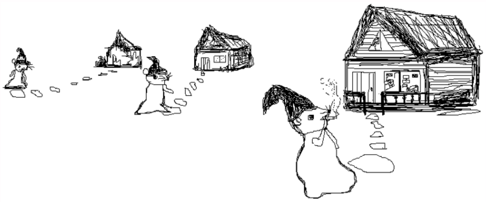

# 👋 UTN - FRP - TUP - Programación 1 - 2025

--

## Programación I - 2025- Documentos, ejemplos y guía de ejercicios 

<em>
  “La ratona y su casa”. Ilustración artística de <a href="https://github.com/MaximaCaceres">Máxima Caceres Alba</a>.
</em>
 

<em>
Representación artística sobre las fases que atraviesa el programador en el proceso de entendimiento del problema. 
Desde la lectura del enunciado, su análisis y el planteo de una estrategia a seguir ... , 
a medida que se acerca a una solución y empieza a ver —y entender— mejor los detalles del problema.
</em>

## Enlaces
[Documentos y guías de ejercicios](https://docs.google.com/document/d/1qGPbiIwmllmy1YvXGmMJ7zKOhPzcun4a4mG60zK98cE/preview?tab=t.0)

---

## ⚠️ Disclaimer

Todo el contenido publicado en este perfil de GitHub, incluyendo repositorios públicos, es proporcionado con fines educativos y/o de desarrollo.

No me hago responsable por el uso indebido, ilegal o malicioso del código por parte de terceros, ya sea mediante forks, clones o redistribuciones. Cada usuario es responsable de cómo utiliza el código publicado.

Mis proyectos no representan necesariamente la opinión ni están vinculados a ninguna organización con la que colabore o haya colaborado.

---

¡Gracias por visitar mi perfil!
